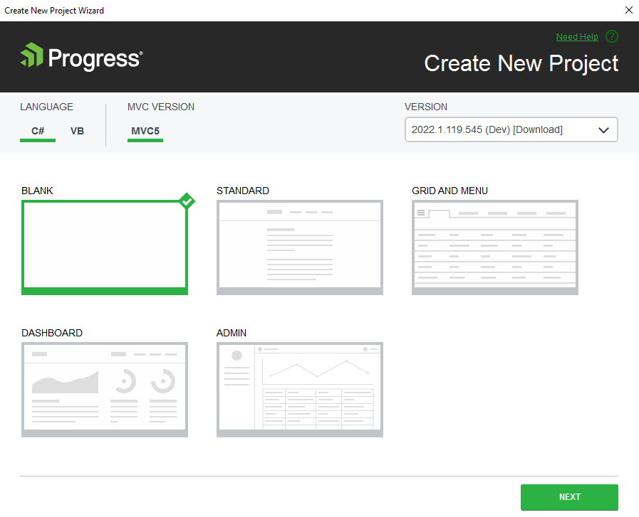
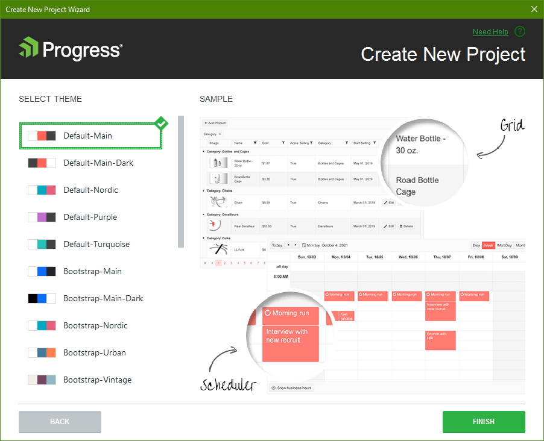

# Creating New Projects

This article demonstrates how to create a project from a template. The newly created project will have the required setup that enables you to immediately start using the Telerik&reg; UI for ASP.NET MVC components.

To use the project templates, you start the **Create New Project Wizard** provided by the Telerik UI for ASP.NET MVC Visual Studio Extensions. With the project templates, you can quickly deploy popular components like Grid and Menu or even entire applications. You don't need to manually [add the client-side resources]()&mdash;the **Create New Project Wizard** handles this task for you.

## Getting the Wizard

To use the **Create New Project Wizard**, install the {{ site.product_long }} Visual Studio Extensions. To get the extensions:

* Use the {{ site.product }} [automated installer for Windows]()&mdash;the extensions are included in the installation package.
* Download the extensions from the [Visual Studio Marketplace](https://marketplace.visualstudio.com/items?itemName=TelerikInc.TelerikASPNETMVCVSExtensions).
* Download the extensions from your [Telerik.com account](https://www.telerik.com/account/product-download?product=KENDOUIMVC).

## Using the Wizard

>The steps to start the wizard may vary between the different Visual Studio versions. The following instructions describe the steps for Visual Studio 2019.

To create a new Telerik UI for ASP.NET MVC application that uses the available templates, start the **Create New Project Wizard** by utilizing either of the following approaches:

* Using the **Extensions** menu in Visual Studio 2019:

    1. Go to the **Extensions** menu.   
    2. Click **Telerik** > **Telerik UI for ASP.NET MVC** > **Create New Telerik Project**.

* Using the **File** menu in Visual Studio 2019:

    1. Click **File** > **New** > **Project**.     
    2. In the search field, type `Telerik ASP.NET MVC`.
    3. Select the **Telerik ASP.NET MVC Application** project type and click **Next**.

You will receive a list of predefined Telerik templates and the Telerik ASP.NET MVC versions list to choose from:

* **Blank Template**&mdash;lets you develop your application from scratch with the Telerik UI components enabled.
* **Standard Template**&mdash;you can start off with three example pages which have Panel Bar, Card and TabStrip components integrated.
* **Grid and Menu Template**&mdash;a small application that contains Grid, Menu and Buttons as a base for your application.
* **Dashboard Template**&mdash;allows you to quickly develop dashboards and dashboard-like applications using the built-in TileLayout component.
* **Admin Dashboard Template**&mdash;manage and visualize your data using different Telerik UI components. 

The wizard detects all the installed versions of Telerik UI for ASP.NET MVC and lists them in the **Version** combobox. This enables you to select a version you want to apply to your project.

On the next page, you can select the visual theme of your Telerik UI for ASP.NET MVC application. If desired, you can also select a specific [swatch](#swatches) for the theme.

## The Created Application

After configuring the project settings, click **Finish** to start the creation of the new Kendo UI web application.

As a result, the wizard:

* Creates a new ASP.NET MVC application.
* Adds CDN references in the Layout file of the project for all Kendo UI styles and scripts. This includes the `vsdoc` script that enables the Visual Studio IntelliSense feature. If you prefer to have the scripts locally, disable the CDN Support through the [configure project]() workflow.  
* Copies all Telerik editor templates.
* (Optional) Copies the `Kendo.Mvc` assembly to your solution folder&mdash;it is possible to change this setting in the [Visual Studio Extensions Options]().
* Adds a reference to the `Kendo.Mvc` assembly.

## Custom Modernizr

The Telerik UI ASP.NET MVC application includes a custom stripped-down Modernizr in a file called `kendo.modernizr.custom.js`. It provides HTML5 element support for old browsers, specifically Internet Explorer.

If you need the Modernizr in your application, remove the existing Modernizr and register another version which includes more components and features. In such cases, if HTML5 element support is required, include the `html5shiv` component to make sure that the newly registered Modernizr [provides such support](http://modernizr.com/docs/#html5inie).

## Swatches

When you select a theme, you can select between three main themes: Default, Bootstrap, and Material. In addition to the styles of the main theme, you can select a specific swatch. A swatch is a set of variables which customize the appearance of the selected main visual theme.

* [Using the Build Process of the Themes](https://docs.telerik.com/kendo-ui/styles-and-layout/sass-themes#using-the-build-process-of-the-themes)
* [How Do I Know Which SASS Theme Corresponds to My Current LESS Theme?](https://docs.telerik.com/aspnet-mvc/styles-and-layout/less-themes-migration#how-do-i-know-which-sass-theme-corresponds-to-my-current-less-theme)

## See Also

* [Integrating Visual Studio in Your .Net Project]()
* [Downloading the Latest Telerik UI for ASP.NET Core Versions]()
