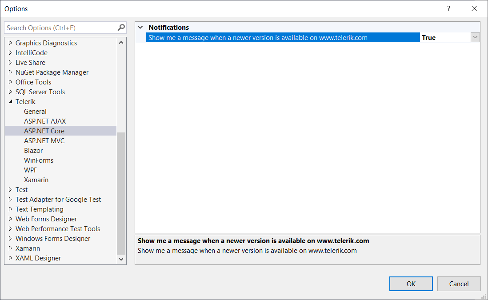

# Visual Studio Integration Overview

To integrate with Visual Studio, Telerik provides the Progress&reg; Telerik&reg; UI for ASP.NET Core Visual Studio (VS) Extensions. They enhance the experience in developing web applications with Telerik UI for ASP.NET Core.

The VS Extensions come with handy templates that ease the creation of new projects. They also help you add {{ site.product_short }} to an existing project or upgrade the {{ site.product_short }} version.
The {{ site.product_short }} VS extensions support VS 2022, 2019 and 2017, and are distributed through the {{ site.product }} installer and the Visual Studio Marketplace.

The VS Extensions help you to increase your productivity by delivering the following:

* [Project Creation wizard]()&mdash;allows you to use pre-configured project templates that include the required package references and client-side resources. These templates enable the quick deployment of popular components like Grid and Menu or even entire Dashboard applications. With the Project Creation wizard you can:
   * Select between project templates for both helper flavors&mdash;HTML Helpers and Tag Helpers.
   * Select the {{ site.framework }} version and target framework.
   * Select the {{ site.product_short }} version that you want to use.
* [Project Conversion]()&mdash;automatically configures any already existing ASP.NET Core application to use the Telerik UI components, and turns it into a complete Telerik application. The wizard lets you select between using CDN or local files for the client-side resources.
* [Project Configuration]()&mdash;allows you to change the visual theme and to configure the right-to-left support, localization, and CDN use in existing projects that are already configured to use the Telerik UI components.
* [Update notifications]()&mdash;the VS Extensions notify you when a new  version of Telerik UI for ASP.NET Core is available and allow you to update your applications.
* The Project Creation and Conversion wizards let you select a visual theme so that only the necessary CSS files are included.

## Installing the Extensions

There are three ways to install the VS Extensions: 

* By using the [automated MSI installer](#installing-with-the-msi)
* By installing from the [Visual Studio Marketplace](#installing-from-visual-studio-marketplace)
* By installing [directly from Visual Studio](#installing-in-visual-studio)

### Installing with the MSI

To install the Telerik UI for ASP.NET Core Visual Studio Extensions, run the [Telerik UI for ASP.NET Core installer]() and verify that the Visual Studio Extensions are selected for installation.

### Installing from Visual Studio Marketplace

Go to the [`{{ site.product_long }} Extension`](https://marketplace.visualstudio.com/items?itemName=TelerikInc.TelerikASPNETCoreVSExtensions) page and click **Download**.

* For [Visual Studio 2017 and 2019](https://marketplace.visualstudio.com/items?itemName=TelerikInc.TelerikASPNETCoreVSExtensions)
* For [Visual Studio 2022](https://marketplace.visualstudio.com/items?itemName=TelerikInc.ProgressTelerikASPNETCoreVSExtensions)

When the download is complete, navigate to the download folder and click on the downloaded file `TelerikUI.ASP.NET.Core.VSPackage.vsix` to install the extensions.

### Installing in Visual Studio

1. Launch Visual Studio.
1. Select **Extensions** from the top menu. (In Visual Studio 2017, this menu is called **Tools**.)
1. Click **Manage Extensions** from the drop-down menu. (In Visual Studio 2017, this menu is called **Extensions and Updates**.)
1. Click **Online** to the left and select **Visual Studio Marketplace**.
1. In the **Search** text box, enter `Telerik {{ site.framework }} VSExtensions` 
1. Select the extension and click **Download**.
1. Visual Studio will apply the changes automatically once you close all Microsoft Visual Studio windows.

## Using the Telerik VS Extensions in VS 2019

- To access the VS extensions from the VS Toolbar, go to **Extensions > Telerik > {{ site.product }}**. Choose one of the two options -  **Create New Project** or **Convert to Telerik Application**.

    

- To access the template projects go to **File** > **New** > **Project** and search for `Telerik`.

    

## Using the Telerik VS Extensions in VS 2017

- To access the VS extensions from the VS Toolbar go to **Telerik > {{ site.product }}**. Choose from one of the two options -  **Create New Project** or **Convert to Telerik Application**.

    

- To access the template projects go to **File** > **New** > **Project** and click on **Installed** > **Telerik** or search for `Telerik` in the serach textbox on the right.

    

## Telerik UI for ASP.NET Core Settings

You can find the Telerik UI for ASP.NET Core VS Extensions settings in the standard Visual Studio options dialog under the Telerik node.

## See Also

* [Creating New Projects with Visual Studio]()
* [Converting Existing Projects with Visual Studio]()
* [Downloading the Latest Telerik UI for ASP.NET Core Versions]()
